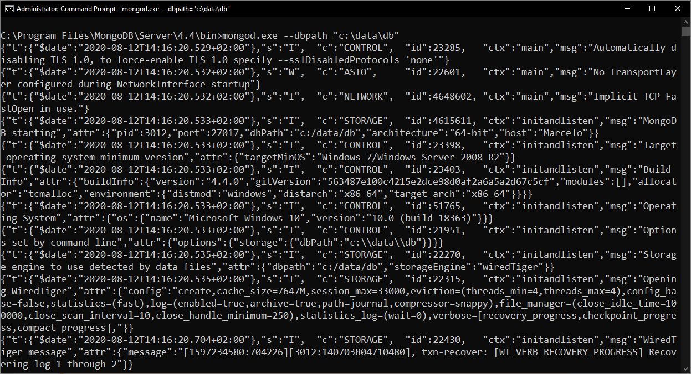

# Database

## SQL

https://en.wikipedia.org/wiki/SQL  

## NoSQL

https://en.wikipedia.org/wiki/NoSQL  

### Ascending and descending order

https://www.kb.blackbaud.co.uk/articles/Article/117098  

### NoSQL vs SQL Databases

[NoSQL vs SQL Databases](https://www.mongodb.com/nosql-explained/nosql-vs-sql)  

[SQL vs NoSQL or MySQL vs MongoDB by Academind](https://www.youtube.com/watch?v=ZS_kXvOeQ5Y)  
<br>

## [**Database Basics**](https://github.com/FBw-26/lessons/blob/master/MongoDB.md):
<br>

### :white_check_mark: MongoDB | SQL

|Database|Command|
|:-------|:------|
|MongoDB |`use <db name>`|
|SQL     |`CREATE DATABASE <db name>;` , `USE <db name>;`|
<br>

### :white_check_mark: Collection | Table

_A place to keep records_  

|Database|Command|
|:-------|:------|
|Creating a collection in MongoDB|`db.createCollection();` , `show collections`|
|Creating a table in SQL|`CREATE TABLE <table name> (<column definitions>);` , `SHOW TABLES;`|

:arrow_right: **_Difference I_:** SQL requires structure, e.g. `DESCRIBE <table name>`  
<br>

### :white_check_mark: Document | Row

_A single record in a collection / table_  

|Database|Command|
|:-------|:------|
|Inserting a document in MongoDB|`db.<collection>.insertOne(<document>);`|
|Inserting a row in MySQL|`INSERT INTO <table name> VALUES (<values>);`|

:arrow_right: **_Difference II:_** MongoDB implicitly creates collections with `.insertOne()`  
<br>

### :white_check_mark: Field | Column

_A value in a record_  

|Database|Command|
|:-------|:------|
|Showing all documents in MongoDB|`db.<collection>.find({})`|
|Showing all rows of a table in SQL|`SELECT * from <table name>`|
<br>

### :white_check_mark: Key | Id

_A key / id uniquely identifies a record_  

|Database|Command|
|:-------|:------|
|Adding IDs to SQL|`CREATE TABLE <table name> ( id NOT NULL AUTO_INCREMENT, <column definitions>, PRIMARY_KEY(id) );`|

:arrow_right: **_Difference III:_** MongoDB implicitly provides unique IDs  
<br>

### :white_check_mark: CRUD: Four basic functions of persistent storage.

_[**CRUD**](https://en.wikipedia.org/wiki/Create,_read,_update_and_delete) aka Create, Read (aka Retrieve), Update and Delete_  

#### Create: Inserting multiple documents / rows:

|Database|Command|
|:-------|:------|
|MongoDB |`db.<collection>.insertMany([{ <document 1> }, { <document 2> }, <...>]);`|
|SQL     |`INSERT INTO <table> VALUES (<row 1>), (<row 2>), <...>;`|

#### Read: Querying the collection / table:

|Database|Command|
|:-------|:------|
|MongoDB |`db.<collection>.find({ <field name>: { criteria } });`|
|SQL     |`SELECT * from <table> WHERE <criteria>`|

#### Update: Updating a document / row:

|Database|Command|
|:-------|:------|
|MongoDB |`db.<collection>.updateOne({ <criteria>, {$set: <values> });`|
|SQL     |`UPDATE <table> SET <values> WHERE <criteria>;`|

#### Delete: Deleting a document / row:

|Database|Command|
|:-------|:------|
|MongoDB |`db.<collection>.deleteOne({ <criteria> });`|
|SQL     |`DELETE FROM <table> WHERE <criteria>;`|

# MongoDB

https://www.mongodb.com/  

## run (Windows 10)

Run MongoDB Community Edition from the Command Interpreter<br><br>

    :rotating_light:  **IMPORTANT**  :rotating_light:

    _You must open the command interpreter as an Administrator._

<br>

* **Create database directory**

    ```
    cd C:\
    ```

    ```
    md "\data\db"
    ```
<br>

* **Start your database**

    ```
    cd C:\Program Files\MongoDB\Server\4.4\bin\
    ```

    ```
    mongod.exe --dbpath="c:\data\db"
    ```

    If the MongoDB database server is running correctly, the Command Interpreter displays:  

    **[initandlisten] waiting for connections**  

    

    
<br><br>

* **Connect to MongoDB**

    To connect a mongo.exe shell to the MongoDB instance, open another Command Interpreter with :warning: Administrative privileges :warning: and run:

    ````
    "C:\Program Files\MongoDB\Server\4.4\bin\mongo.exe"
    ````

    

## basics commands


