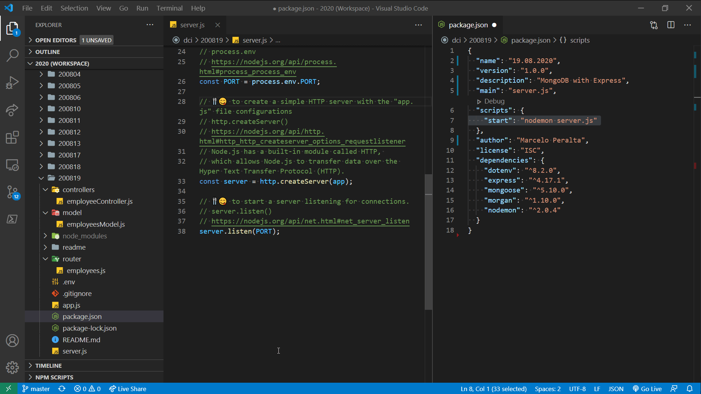
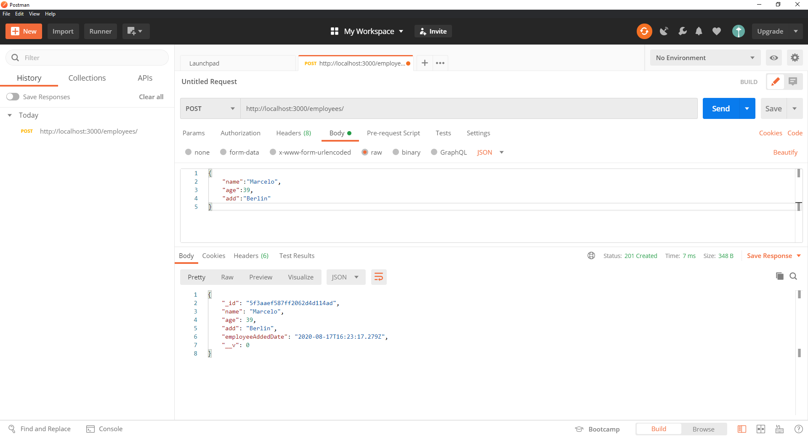
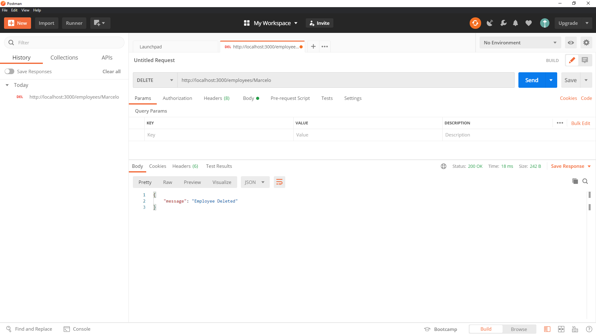
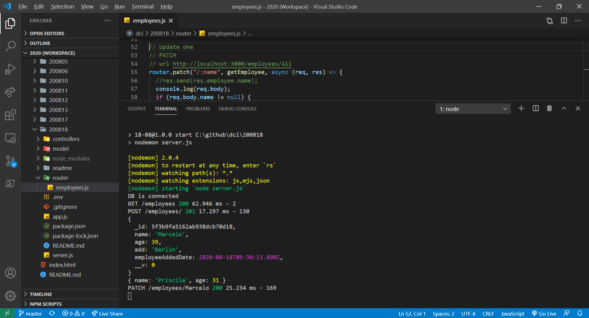

<li style="background-color: rgb(51, 153, 51);">
<svg role="img" viewBox="0 0 24 24" xmlns="http://www.w3.org/2000/svg"><title>Node.js icon</title><path d="M11.998,24c-0.321,0-0.641-0.084-0.922-0.247l-2.936-1.737c-0.438-0.245-0.224-0.332-0.08-0.383 c0.585-0.203,0.703-0.25,1.328-0.604c0.065-0.037,0.151-0.023,0.218,0.017l2.256,1.339c0.082,0.045,0.197,0.045,0.272,0l8.795-5.076 c0.082-0.047,0.134-0.141,0.134-0.238V6.921c0-0.099-0.053-0.192-0.137-0.242l-8.791-5.072c-0.081-0.047-0.189-0.047-0.271,0 L3.075,6.68C2.99,6.729,2.936,6.825,2.936,6.921v10.15c0,0.097,0.054,0.189,0.139,0.235l2.409,1.392 c1.307,0.654,2.108-0.116,2.108-0.89V7.787c0-0.142,0.114-0.253,0.256-0.253h1.115c0.139,0,0.255,0.112,0.255,0.253v10.021 c0,1.745-0.95,2.745-2.604,2.745c-0.508,0-0.909,0-2.026-0.551L2.28,18.675c-0.57-0.329-0.922-0.945-0.922-1.604V6.921 c0-0.659,0.353-1.275,0.922-1.603l8.795-5.082c0.557-0.315,1.296-0.315,1.848,0l8.794,5.082c0.57,0.329,0.924,0.944,0.924,1.603 v10.15c0,0.659-0.354,1.273-0.924,1.604l-8.794,5.078C12.643,23.916,12.324,24,11.998,24z M19.099,13.993 c0-1.9-1.284-2.406-3.987-2.763c-2.731-0.361-3.009-0.548-3.009-1.187c0-0.528,0.235-1.233,2.258-1.233 c1.807,0,2.473,0.389,2.747,1.607c0.024,0.115,0.129,0.199,0.247,0.199h1.141c0.071,0,0.138-0.031,0.186-0.081 c0.048-0.054,0.074-0.123,0.067-0.196c-0.177-2.098-1.571-3.076-4.388-3.076c-2.508,0-4.004,1.058-4.004,2.833 c0,1.925,1.488,2.457,3.895,2.695c2.88,0.282,3.103,0.703,3.103,1.269c0,0.983-0.789,1.402-2.642,1.402 c-2.327,0-2.839-0.584-3.011-1.742c-0.02-0.124-0.126-0.215-0.253-0.215h-1.137c-0.141,0-0.254,0.112-0.254,0.253 c0,1.482,0.806,3.248,4.655,3.248C17.501,17.007,19.099,15.91,19.099,13.993z"></path></svg>
</li>

# MongoDB

## run on Windows 10

Run MongoDB Community Edition from the Command Interpreter<br><br>

:rotating_light:  **IMPORTANT**  :rotating_light:

_You must open the command interpreter as an Administrator._

<br>

**Start your database**

```
cd C:\Program Files\MongoDB\Server\4.4\bin\
```

```
mongod.exe --dbpath="c:\data\db"
```

If the MongoDB database server is running correctly, the Command Interpreter displays:  

**[initandlisten] waiting for connections**  


<br><br>

**Connect to MongoDB**

To connect a mongo.exe shell to the MongoDB instance, open another Command Interpreter with :warning: Administrative privileges :warning: and run:

````
"C:\Program Files\MongoDB\Server\4.4\bin\mongo.exe"
````


<br>

**Create a empty Database using MongoDB Compass Community**


# Connection with MongoDB using JavaScript, Node.js, Express, Mongoose and Dotenv

## :computer: Installing the project based on existing ```package.json```

```
git clone https://github.com/marcelosperalta/dci/tree/master/200818
```

```
npm install
```
or  

:dvd: Create a new ```package.json```

```
git init -y
```

:dvd: Add the line below into ```package.json```

```
  "scripts": {
    "start": "nodemon server.js"
  },
```

:dvd: Install [express](https://www.npmjs.com/package/express)

```
npm i express
```

:dvd: Install [mongoose](https://www.npmjs.com/package/mongoose)

```
npm i mongoose
```

:dvd: Install [nodemon](https://www.npmjs.com/package/nodemon)

```
npm i nodemon
```

:dvd: Install [morgan](https://www.npmjs.com/package/morgan)

```
npm i morgan
```

:dvd: Install [dotenv](https://www.npmjs.com/package/dotenv)

```
npm i dotenv
```

:page_facing_up: Create an ```.env``` file and add the lines below

```
PORT=3000
DB_URL=mongodb://localhost:27017/employees
```

<div align="center">:rotating_light: :rotating_light: :rotating_light: :rotating_light: :rotating_light:</div>
<div align="center">The <code>.env</code> was not added to the <code>.gitignore</code> because this is a repository for study.<br>
In a company envirorment, never push this type of file to a repository like GitHub (or any other version control system).<br>:link: See <a href="https://12factor.net/config">The Twelve-Factor App - Config</a></div>
<div align="center">:rotating_light: :rotating_light: :rotating_light: :rotating_light: :rotating_light:</div>

:page_facing_up: Create an ```.gitignore``` file and add the line below

```
node_modules
```

:page_facing_up: Create an [app.js](https://github.com/marcelosperalta/dci/blob/master/200818/app.js) and [server.js](https://github.com/marcelosperalta/dci/blob/master/200818/server.js) files and copy de code from this repository.  

:file_folder: Create a [model](https://github.com/marcelosperalta/dci/tree/master/200818/model) folder, create an [employeesModel.js](https://github.com/marcelosperalta/dci/blob/master/200818/module/employeesModel.js) file inside, and copy de code from this repository.  

:file_folder: Create a [router](https://github.com/marcelosperalta/dci/tree/master/200818/router) folder, create an [employees.js](https://github.com/marcelosperalta/dci/blob/master/200818/router/employees.js) file inside, and copy de code from this repository.  

:file_folder: Create a [controllers](https://github.com/marcelosperalta/dci/tree/master/200818/controllers) folder, create an [employeesController.js](https://github.com/marcelosperalta/dci/blob/master/200818/controllers/employeeController.js) file inside, and copy de code from this repository.  

**_Project Structure:_**

  
:arrow_up: Navigation on GitHub using [Octotree](https://www.octotree.io/)

## :runner: Run the project

````
npm start
````


:arrow_up: GIF generated with [ShareX](https://getsharex.com/)  

**or run using [Gitpod](https://www.gitpod.io/)**  

[](https://gitpod.io/#https://github.com/marcelosperalta/mock-up_e-learning_platform)

### :arrow_right: Flowchart

## :cd: Using [Postman](https://www.postman.com/)

**_Get data from Database (empty scenario)_**  
GET  
http://localhost:3000/employees/  
  

**_Add data to Database_**  
POST  
http://localhost:3000/employees/  
```
{
    "name": "Marcelo",
    "age": 39,
    "add": "Berlin"
}
```
  

**_Get data from Database_**  
GET  
http://localhost:3000/employees/Marcelo  
  

**_Delete data from Database_**  
DELETE  
http://localhost:3000/employees/Marcelo  
  

**_Update data from Database_**  
PATCH  
http://localhost:3000/employees/Marcelo  
  
  

## Tools

<a href="https://shields.io"></a>  

